# Progress Tracker of the project

## Adding Specular and Ambient terms

    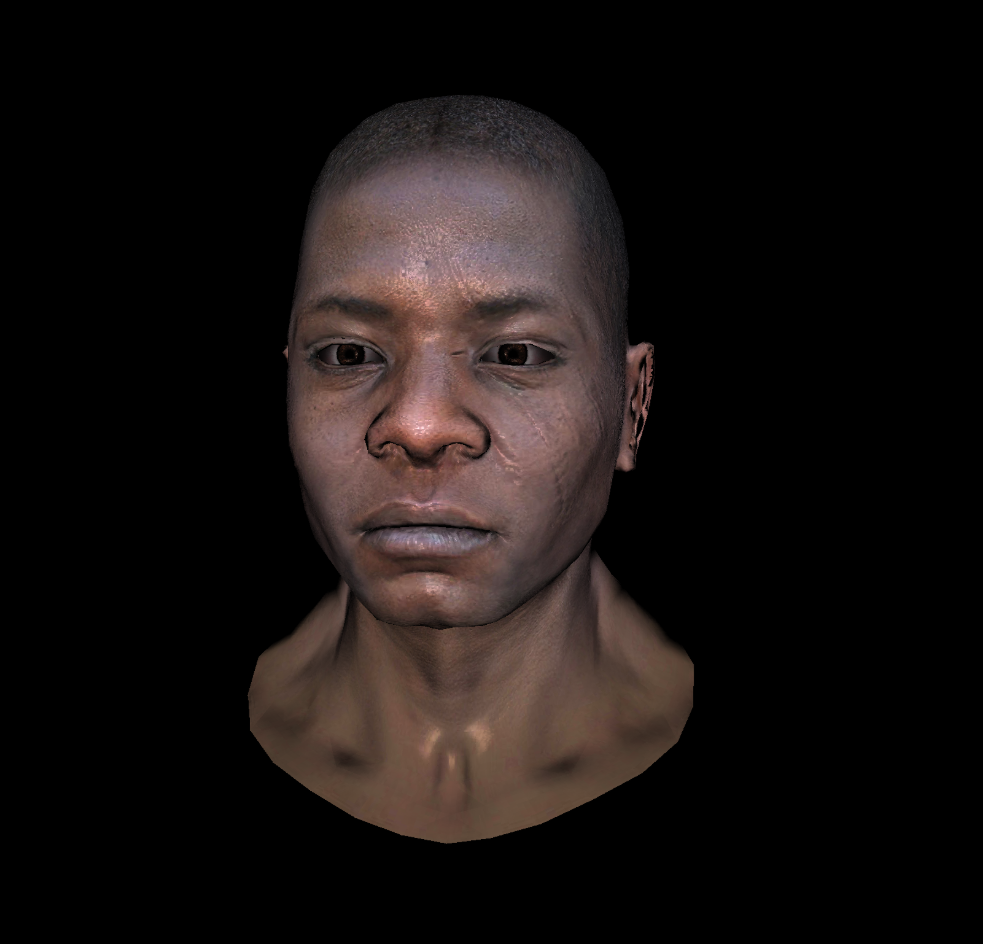
    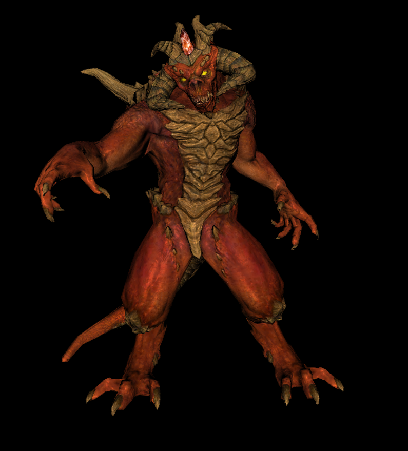

## Normal Mapping in Darboux frame

    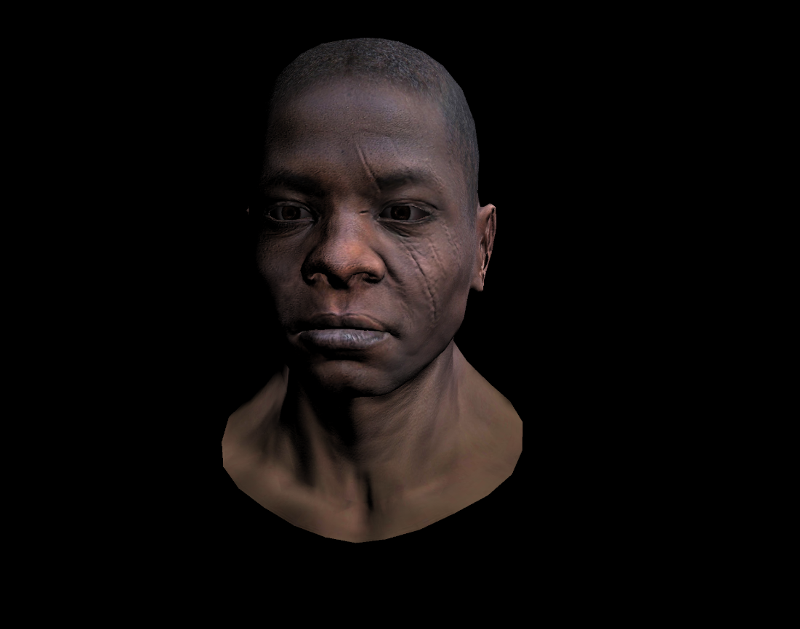
    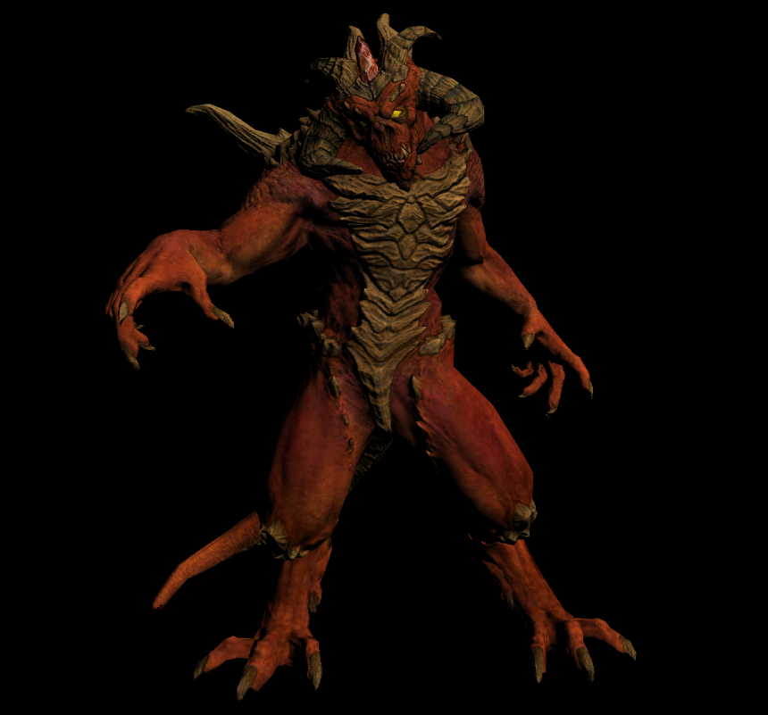

## Gouraud Shading with moving camera

    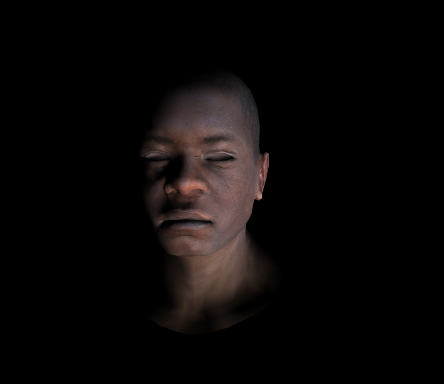

## With perspective view

  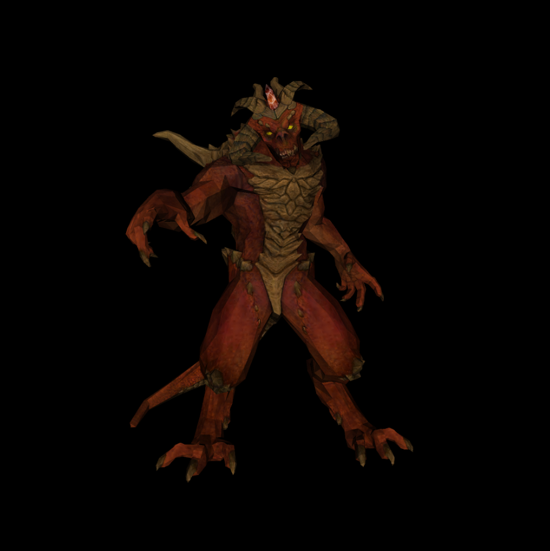
  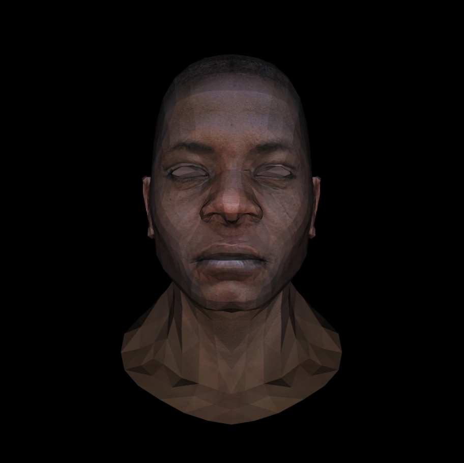

## Orthogonal View

    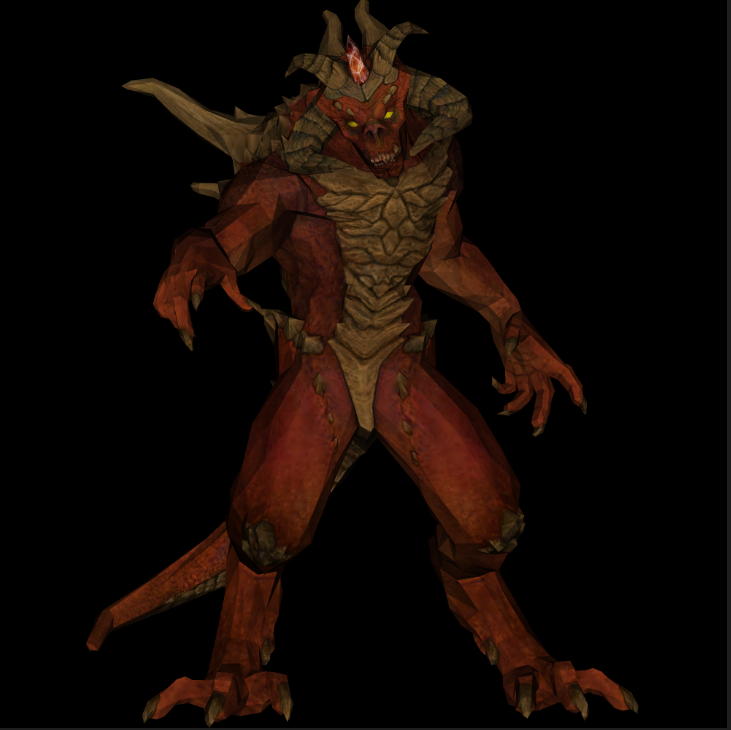
    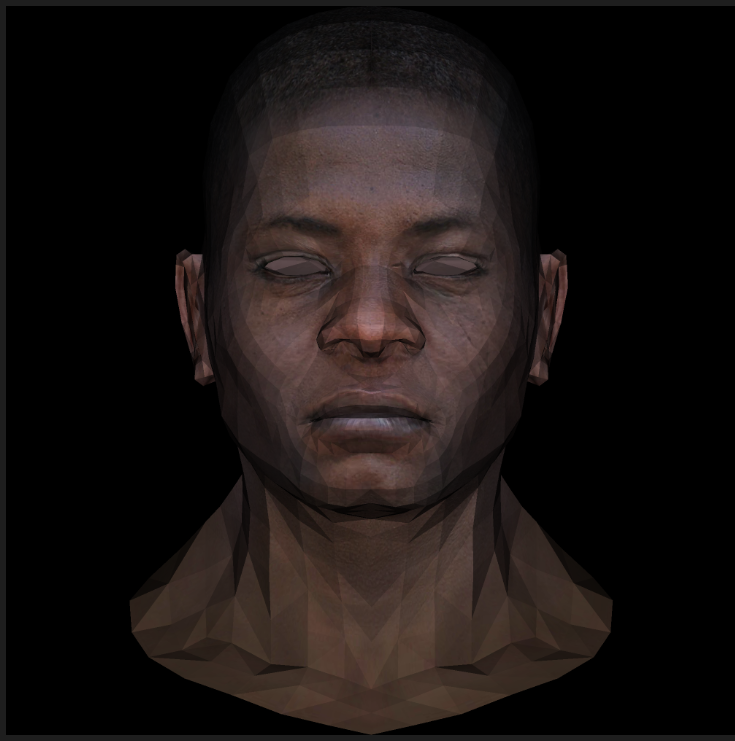

## Without Z-buffering

    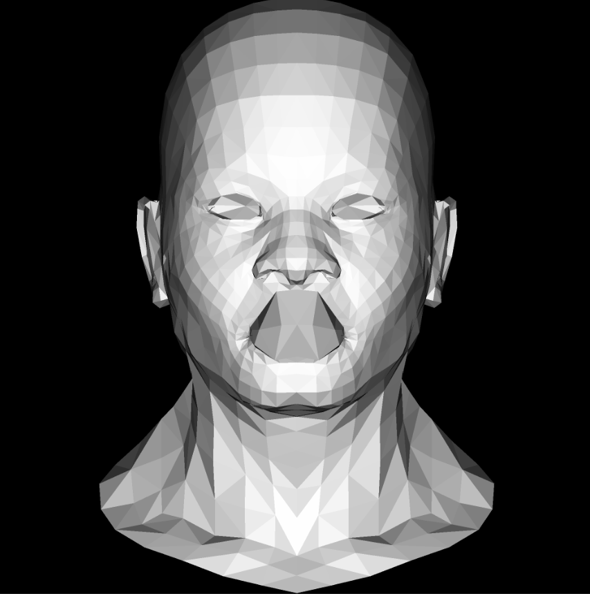

## Bresenham's line Algorithm

    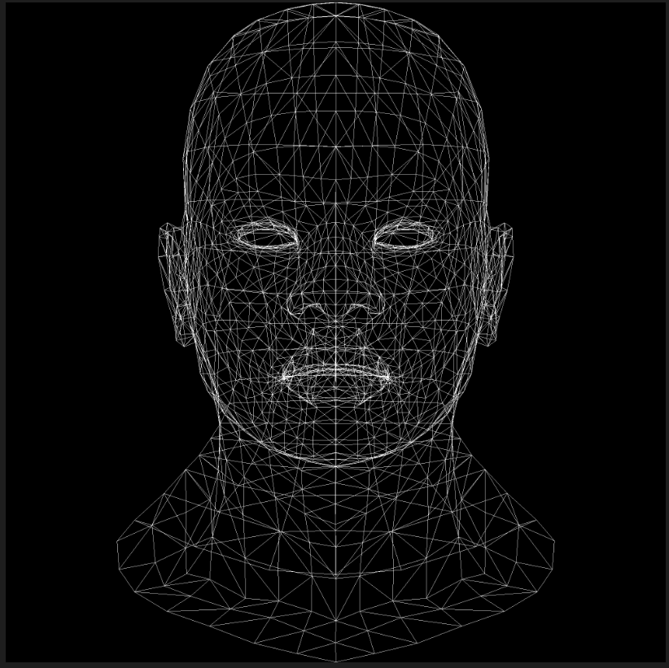

